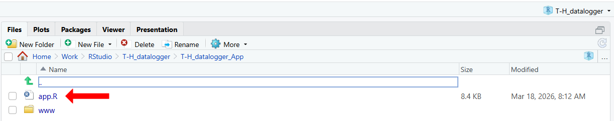
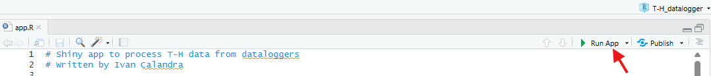
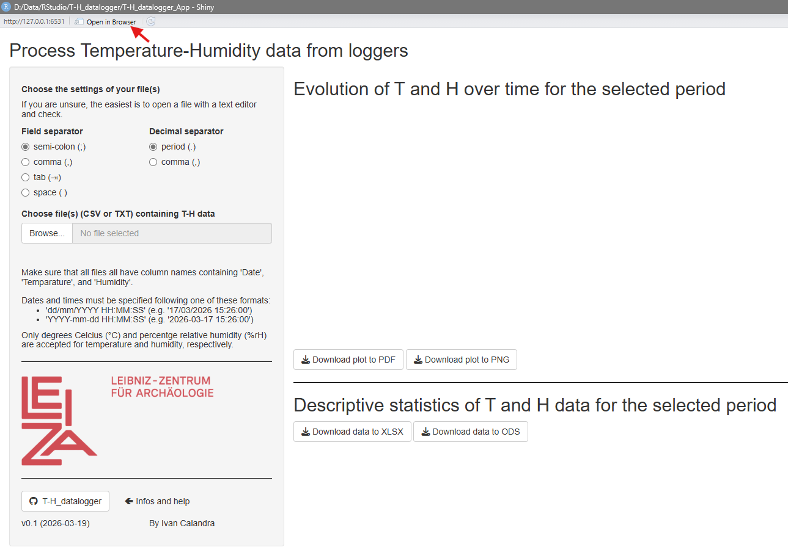
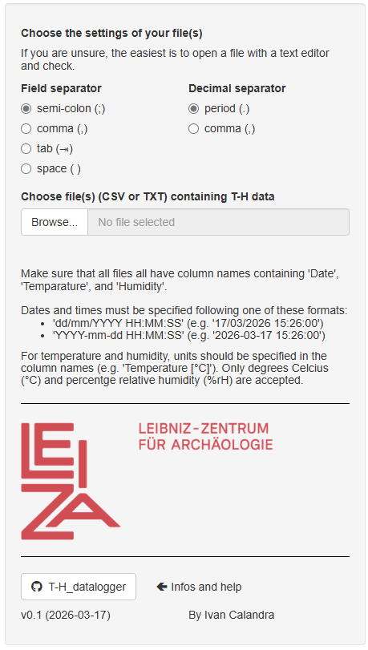
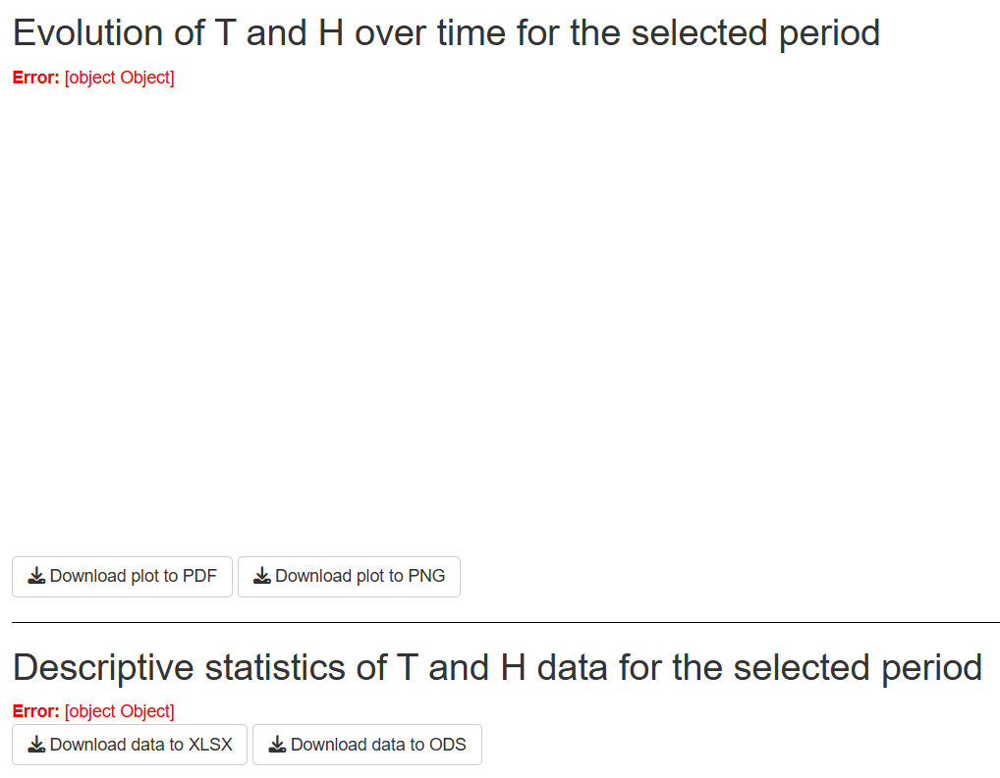
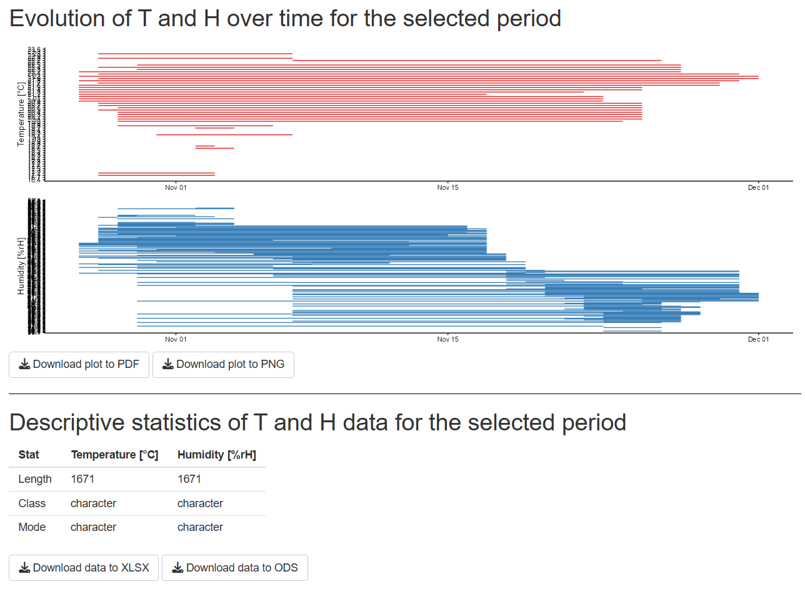
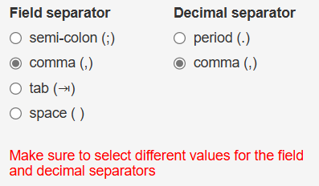
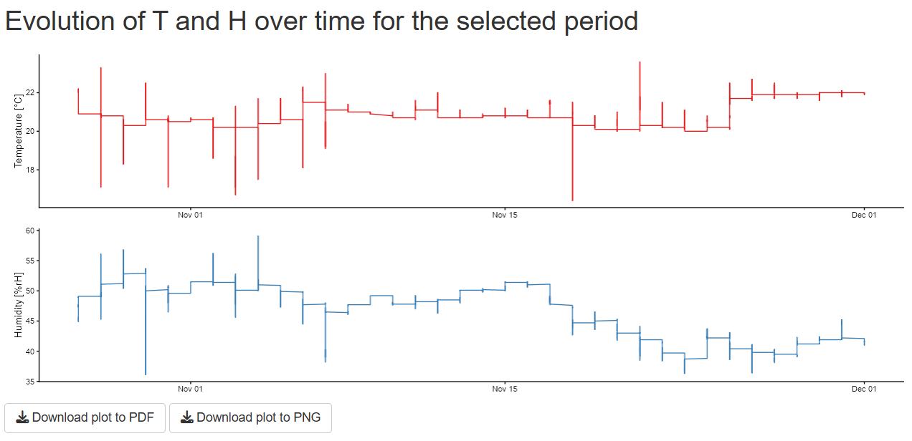
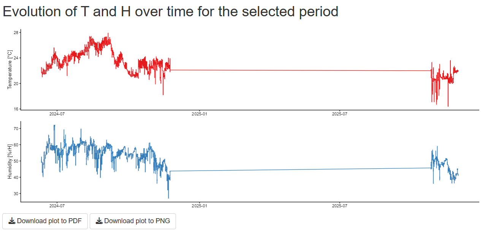
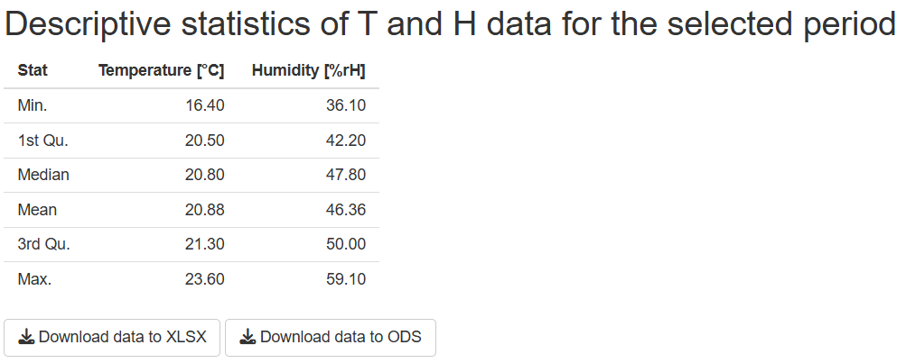

<!-- TOC ignore:true -->
# T-H_datalogger

<!-- TOC ignore:true -->
## Table of content

<!-- TOC -->

- [Purpose](#purpose)
- [How to use the App](#how-to-use-the-app)
    - [On the LEIZA server](#on-the-leiza-server)
    - [Locally with RStudio](#locally-with-rstudio)
        - [Pre-requisites](#pre-requisites)
        - [Download the repository](#download-the-repository)
        - [Start the App](#start-the-app)
    - [Saving](#saving)
- [Operating instructions](#operating-instructions)
    - [Side bar](#side-bar)
    - [Evolution of T and H over time for the selected period](#evolution-of-t-and-h-over-time-for-the-selected-period)
    - [Descriptive statistics of T and H data for the selected period](#descriptive-statistics-of-t-and-h-data-for-the-selected-period)
- [How to adapt the App](#how-to-adapt-the-app)
- [How to contribute](#how-to-contribute)
- [License](#license)

<!-- /TOC -->

---

*The releases are available and citable on Zenodo* **(TO ADJUST)**  

---

# Purpose

This repository contains a [**Shiny App**](T-H_datalogger_App/app.R) to process temperature and humidity data from the data loggers at the [TraCEr lab](https://www.leiza.de/forschung/infrastrukturen/labore/tracer) / [IMPALA](https://www.leiza.de/forschung/infrastrukturen/labore/impala). 

The App is designed for Testo 174H loggers. If you would like to adapt the App to your needs, check the sections [How to adapt the App](#how-to-adapt-the-app), [How to contribute](#how-to-contribute) and [License](#license).

---

# How to use the App

## On the LEIZA server
**The easiest is to run the App on the LEIZA server:** https://tools.leiza.de/t-h-datalogger/

## Locally with RStudio
Alternatively, the App can also be run locally using RStudio.  
This option is especially useful if you intend to edit the App (see sections [How to adapt the App](#how-to-adapt-the-app) and [How to contribute](#how-to-contribute)).

### Pre-requisites
The Shiny App is written in [Shiny](https://shiny.posit.co/) using [RStudio](https://posit.co/products/open-source/rstudio/), so you first need to download and install [R](https://www.r-project.org/) and [RStudio](https://posit.co/download/rstudio-desktop/). But fear not, **no knowledge of R/Rstudio is needed to run the App**!

### Download the repository
There are two ways to get the App: 
1. Download my [GitHub repository](https://github.com/ivan-paleo/T-H_datalogger/archive/refs/heads/main.zip) or its latest [release](https://github.com/ivan-paleo/T-H_datalogger/releases) as a ZIP archive, and unzip it. You can access the repository with the source code by clicking on the button in the side bar of the App (see [side bar](#side-bar)).  
2. [Fork and clone](https://happygitwithr.com/fork-and-clone.html) my [GitHub repository](https://github.com/ivan-paleo/T-H_datalogger).

### Start the App
1.  Open the file [T-H_datalogger.Rproj](T-H_datalogger.Rproj) with RStudio.
2.  Open the file `T-H_datalogger_App\app.R` from within RStudio by clicking on it in the `Files` panel.

>

>     
>    <i>Open the App from within RStudio.</i>
>

3.  Run the App by clicking on the button `Run App` in the top right corner.

>

>     
>    <i>Run the App from within RStudio.</i>
>

4.  The App will open in a new RStudio window. I recommend to open the App in your browser (click on `Open in Browser` at the top to open the App), and to maximize the window (or at least make it large enough so that the fields do not overlap).

>

>     
>    <i>App freshly opened.</i>
>

5.  Enter the information as explained in the following section ([Operating instructions](#operating-instructions)).

## Saving
**In both cases (LEIZA server and local), neither input nor output is saved in the App.** If you close the App (or the browser tab), all input and output will be deleted (but no file will be deleted from your computer).  
**In order to save the ouput, use the download buttons** (see [Operating instructions](#operating-instructions)).

---

# Operating instructions

## Side bar

>

>     
>    <i>Sidebar.</i>
>

First, choose the field and decimal separators for the file(s) containing temperature (T) and relative humidity (H) data.   
*Field separator* refers to the symbol used to separate values (usually comma, semi-colon, tab or space), while the *decimal separator* is the symbol used to mark decimals (usually comma or period).  
If you are unsure, simply open a file with a text editor and check which symbols are used. Alternatively, you can try out after importing file(s) as the files will be reprocessed interactively if you change the separators.  
Using wrong separators will throw errors in the main panel.  

>

>     
>    <i>Error hinting at an inappropriate choice of separators for the selected file(s).</i>
>

Alternatively, it can lead to meaningless output in the main panel (see below for meaningful outputs).

>

>     
>    <i>Meaningless output hinting at an inappropriate choice of separators for the selected file(s).</i>
>

If you intend to import several files, make sure that they all use the same separators.  
For obvious reasons, **the field and decimal separators must be different**. If you select `comma` for both, a warning will appear. Note that it is not an error, i.e. the code will run, but will very likely lead to issues.

>

>     
>    <i>Warning if both field and decimal separators are identical.</i>
>

Second, select the file(s) (**only CSV and TXT formats are supported**) containing temperature (T) and humidity (H) data.  
Make sure that **all files all have column names containing 'Date', 'Temparature', and 'Humidity'**.  
**Dates and times must be specified following one of these formats**:  
- 'dd/mm/YYYY HH:MM:SS', e.g. '17/03/2026 15:26:00'  
- 'YYYY-mm-dd HH:MM:SS', e.g. '2026-03-17 15:26:00' (= ISO 8601)  

For temperature and humidity, units should be specified in the column names (e.g. 'Temperature [°C]'). **Only degrees Celcius (°C) and percentge relative humidity (%rH) are accepted currently.**  
After importing the files, output will be displayed automatically in the main panel. Note that it may take a few seconds to load if there is a lot of data to process.

Last, select the period you are interesting in using the calendar widget. The output will be updated automatically.

Click the icon *T-H_datalogger* to open the repository on GitHub.

## Evolution of T and H over time for the selected period
The upper graph shows the evolution of temperature over the selected time period in red. The lower graph shows the evolution of humidity over the same period in blue.  

>

>     
>    <i>Main panel output of the evolution of T and H over time for the selected period.</i>
>

In case the files contain non-continuous data (interruption of data logging), straight lines will connect the recorded data. 

>

>     
>    <i>Evolution of T and H over time for the selected period with non-continuous data being connected with a straight line.</i>
>

**Click on the buttons below the graphs to download them to PDF (vector) or PNG (raster).** This is the only way to save the output (see section [Saving](#saving)). 

## Descriptive statistics of T and H data for the selected period
The table shows summary/descriptive statistics of temperature and humidity over the selected time period:  

- Min. = minimum value  
- 1st Qu. = first quartile  
- Median = median  
- Mean = arithmetic mean  
- 3rd Qu. = third quartile  
- Max. = maximum value

All calculations are performed by the R function [`summary()`](https://www.rdocumentation.org/packages/base/versions/3.6.2/topics/summary). Within this function, the arithmetic mean is calculated with the R function [`mean()`](https://www.rdocumentation.org/packages/base/versions/3.6.2/topics/mean), while all other statistics are calculated with the R function [`quantile()`](https://www.rdocumentation.org/packages/stats/versions/3.6.2/topics/quantile).

**Click on the buttons below the table to download it to XLSX or ODS.** This is the only way to save the output (see section [Saving](#saving)). 

>

>     
>    <i>Main panel output of the descriptive statistics of T and H over time for the selected period.</i>
>

---

# How to adapt the App
I have tried to make the code of the App as clear as possible and to comment it as much as possible. This is surely not perfect, but I hope this will be enough for future developments and adaptations.

If you would like to adapt the App to your needs, feel free to do so on your own (see section [Download the repository](#download-the-repository)). Nevertheless, **I would appreciate if you would be willing to [contribute](#how-to-contribute)**! You can also get in touch with me directly.

---

# How to contribute
I appreciate any comment from anyone (expert or novice) to improve this App, so do not be shy!  
There are three possibilities to contribute.

1.  Submit an issue: If you notice any problem or have a question, submit an [issue](https://docs.github.com/en/issues/tracking-your-work-with-issues/learning-about-issues/about-issues). You can do so [here](https://github.com/ivan-paleo/T-H_datalogger/issues).  
2.  Propose changes: If you know how to write a [Shiny App](https://shiny.posit.co/), please propose edits as a [pull request](https://docs.github.com/en/pull-requests/collaborating-with-pull-requests/proposing-changes-to-your-work-with-pull-requests/about-pull-requests) (abbreviated "PR").
3.  Send me an email: For options 1-2, you need to create a GitHub account. If you do not have one and do not want to sign up, you can still write me an email (Google me to find my email address).

By participating in this project, you agree to abide by our [code of conduct](CONDUCT.md).

---

# License

This work is licensed under a [Creative Commons Attribution-NonCommercial-ShareAlike 4.0 International License](http://creativecommons.org/licenses/by-nc-sa/4.0/). See [LICENSE](LICENSE).

Author: Ivan Calandra

---

*License badge, file and image from Soler S. cc-licenses: Creative Commons Licenses for GitHub Projects, <https://github.com/santisoler/cc-licenses>.*
